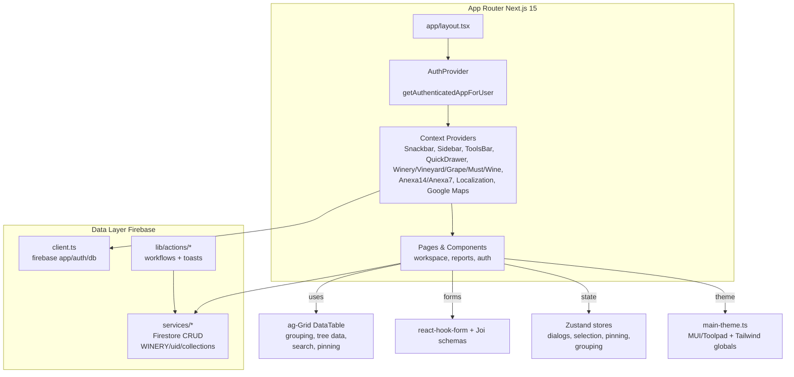
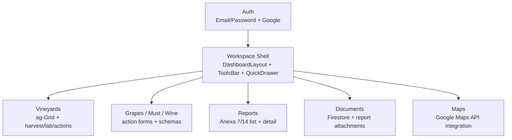
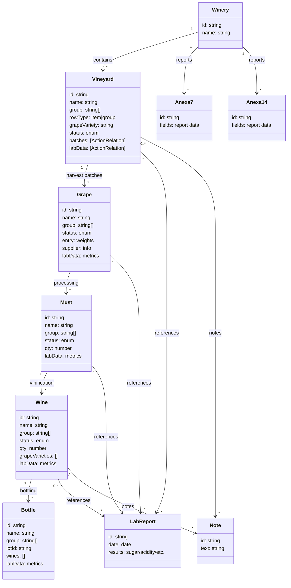

# Wineops Developer Guide

## Product Snapshot

WineOps PWA is a winery operations platform built on Next.js 15 (App Router) with React 19, MUI 7 + Toolpad, ag-Grid Enterprise, and Firebase Auth/Firestore. It covers:

Key capabilities in scope:

- Wine production: vineyards, grapes, primary/secondary vinification, bottling
- Reports: Anexa 7 and Anexa 14 (print-friendly)
- Documents, preferences, and widgets dashboards

## Quickstart

Use these commands to install, run, and validate:
```bash
# Install deps
pnpm install

# Dev server (Turbopack)
pnpm --filter pwa dev

# Production build
pnpm --filter pwa build

# Lint
pnpm --filter pwa lint

# Format
pnpm format
```

## Environment Variables (required)

Validated at import in `src/lib/envs/client.ts`; missing values throw immediately. Configure these before running:

- `NEXT_PUBLIC_FIREBASE_API_KEY`
- `NEXT_PUBLIC_FIREBASE_AUTH_DOMAIN`
- `NEXT_PUBLIC_FIREBASE_PROJECT_ID`
- `NEXT_PUBLIC_FIREBASE_STORAGE_BUCKET`
- `NEXT_PUBLIC_FIREBASE_MESSAGING_SENDER_ID`
- `NEXT_PUBLIC_FIREBASE_APP_ID`
- `NEXT_PUBLIC_GOOGLE_MAPS_API_KEY` (used by `APIProvider` in `context/providers.tsx`)

Place them in `apps/pwa/.env.local` for local work.

## Architecture Overview

How layouts, providers, data layer, and UI pieces connect:

- **App Router layouts**: `src/app/layout.tsx` wraps `AppRouterCacheProvider` → `AuthProvider` (server-fed user from `getAuthenticatedAppForUser`) → `context/providers.tsx`. Public surface under `(auth)` + landing; workspace under `(private)/workspace`.
- **Provider stack** (`src/context/providers.tsx`): Snackbar, Sidebar/Toolsbar/QuickDrawer, Bottle/Winery/Vineyard/Grape/Must/Wine/Anexa14/Anexa7 providers, LocalizationProvider (Day.js), Google Maps APIProvider. Order matters—leave as-is unless necessary.
- **State**: Domain data via React context; UI state via Zustand stores (`src/store` for dialogs, selections, pinning, grid grouping, etc.).
- **Data layer**: Firebase client in `src/lib/firebase/client.ts`; Firestore service helpers in `src/lib/firebase/services/*` scoped to `WINERY/{uid}/<collection>` (constants in `config.ts`). Multi-step workflows live in `src/lib/actions/*`.
- **Forms/validation**: `react-hook-form` + Joi resolvers; schemas in `src/models/schemas/**/*`, sample payloads in `src/data`.
- **UI/theming**: MUI/Toolpad `DashboardLayout` (`components/layout/workspace-layout.tsx`), Notistack for toasts, Tailwind utilities in `src/app/globals.css`. Theme in `src/lib/themes/main-theme.ts` (Lato typography, light/dark, component overrides).
- **Routing/nav**: Nav map in `components/navigation/sidebar-navigation.tsx`; routes mirror `app/(private)/workspace/...`.

### Architecture Diagram



## ag-Grid Deep Dive (DataTable)

How the shared grid behaves and what it expects:

The reusable table lives in `components/table/data-table`. Modules enabled: RowGrouping, TreeData, RowDrag, SetFilter, SideBar, StatusBar, RichSelect, ExcelExport, MasterDetail, Find, Validation, PinnedRow, RowSelection. Key behaviors:

- **Data shape**: Each row must have `id`, `group: string[]` (path segments), and `rowType` (`item`/`group`). The component normalizes missing `group` to `[]` and default `rowType` to `"item"`.
- **Tree data vs column grouping**: Default mode uses tree data (`group` path). Pivot icon or `groupByButtons` switch to column grouping; tree data is restored when grouping is cleared. Auto-group columns toggle visibility when switching modes.
- **Grouping/ungrouping dialogs**: ToolsBar “SelectAll/Deselect” icons open dialogs (`group-entities`, `ungroup-entities`). Selected items are regrouped via `updateRowsGroup`, which:
  - Creates missing group nodes
  - Moves selected rows into the chosen hierarchy
  - Removes unused group nodes
  - Persists changes through the relevant Firestore service (`db[entityName].updateGroup`)
- **Drag & drop grouping**: Tree data rows support row drag. Hovering a potential parent highlights it; dropping updates parent-child positioning within the grid (visual). Persist via grouping dialogs if the move should be saved.
- **Selection**: Multi-row selection with descendant selection enabled. Selection updates `useSelectedEntitiesStore`; dialogs and actions read from this store.
- **Pinning**: ToolsBar pin icon toggles pin/unpin for the current selection via `usePinnedEntitiesStore`. `isRowPinned` marks pinned rows at the top; row class rules add styling (`pinned-row`, `row-dragging`, `cell-drag-over`).
- **Search/find**: ToolsBar search box uses ag-Grid Find module. `activeMatchNum` shows `current/total`; next/previous buttons walk matches. `findSearchValue` is fed into the grid via `findSearchValue` prop.
- **Filtering/sorting**: SetFilter module is registered. Enable per-column filters by adding `filter: true` or filter configs in column defs. Sorting uses ag-Grid defaults; declare `sortable: true` on columns as needed.
- **Grouping buttons**: `groupByButtons` (per table) render pivot toggle buttons above the grid. Clicking toggles `useGridStore.groupedField`, which calls `setRowGroupColumns` and adjusts column visibility (e.g., hides `autoGroupColumnDef` headers when grouped).
- **Row identity**: `getRowId` defaults to `data.id`. Supply a custom `getRowId` if your data uses a different key.
- **Row data sources**: `rowData` is derived from `data` prop; grouped view uses `filteredData` (items only). When grouping via column group, `rowData` is fed directly.
- **Search layout height**: Grid container uses `h-[calc(100vh-180px)]`; ensure surrounding layouts leave room for toolbar and drawers.
- **Exports**: ExcelExport module is enabled; add UI hooks to trigger `gridRef.current.api.exportDataAsExcel()` if needed.

## Feature Map (by area)

What lives where across the product:

- **Auth**: Email/password + Google (Toolpad `SignInPage`). `useAuth` exposes sign in/up, Google popup, sign out, password reset, and confirm password reset.
- **Workspace shell**: Quick drawers for actions, session built from Firebase user, sidebar open state in `SidebarProvider`, ToolsBar controlling search/grouping/pinning, DashboardLayout slots for toolbar actions and account footer.
- **Vineyards**: ag-Grid dashboard with grouping and actions (harvest, lab report, irrigation, pest inspection, pruning, weed removal, soil monitoring, green harvest, fertilizer/pesticide application). Harvest action writes vineyard status, creates grape batch, creates action; lab action writes lab report, links to vineyard.
- **Grapes / Must / Wine**: Similar dashboards with action forms (decant, lab results, processing) and validation schemas in `src/models/schemas/actions/*`.
- **Reports**: Anexa 7/14 list pages and detail views; print-friendly tables in `components/table/anexa7` and `components/table/anexa14` with print CSS in `globals.css`.
- **Documents**: Aggregated from Firestore `DOCUMENTS` plus attachments from lab reports (`context/winery`).
- **Maps**: Google Maps API available through `APIProvider`; helper for centroid in `src/helpers/map-helpers.ts`.

### Feature Map Diagram


## Key Directories

Main folders to know in the PWA workspace:

- `src/app` – App Router layouts and pages (auth, workspace, reports)
- `src/components` – Layout shells, dashboards, ag-Grid tables, forms, dialogs, drawers, widgets
- `src/context` – Domain providers (vineyard, grape, must, wine, bottle, anexa7/14) and UI providers (sidebar, tools-bar, quick-drawer)
- `src/lib` – Firebase client/auth/server, actions, themes, env parsing
- `src/models` – Types and Joi schemas for entities/actions
- `src/store` – Zustand stores for dialogs, selections, pinning, grid grouping, search state
- `src/data` – Sample data, constants, country list, system variables
- `src/utils` / `src/helpers` – Object cleanup, generators, formatting, map math

### Key Directories Tree
```
apps/pwa/src/
- app/
  - (auth), (private)/workspace, reports, layout.tsx, globals.css
- components/
  - layouts, dashboards, tables, forms, dialogs, drawers, widgets
- context/
  - vineyard, grape, must, wine, bottle, anexa7, anexa14, sidebar, tools-bar, quick-drawer, providers.tsx
- lib/
  - firebase (auth, client, services, server), actions, themes, envs
- models/
  - types, schemas (Joi)
- store/
  - zustand stores (dialogs, selection, pinning, grouping, search)
- data/
  - samples, constants, country list, system variables
- utils/ and helpers/
  - formatting, cleanup, generators, map helpers
```

## Data Model Notes

Conventions that keep entity shapes and Firestore collections consistent:

- Base entity: `id`, `name`, `group: string[]`, `rowType` (`item`/`group`). Normalize `group` to `[]` instead of `undefined` to keep tree data stable.
- Collections: `WINERY`, `VINEYARDS`, `GRAPES`, `NOTES`, `LAB_REPORTS`, `ANEXA7`, `ANEXA14`, plus related artifacts (wines, bottles, documents) scoped under `WINERY/{uid}/...`.
- Vineyard: grape variety/color, cadastral numbers, certifications, status, actions, lab data refs, batches (grape lots), and supply metrics.
- Grape: intake/entry weights, supplier and transport info, status, certifications, lab data, metrics, processing info, actions, and documents.
- Must: qty, grape variety/source, status, lab data (current and historical), metrics, actions, and documents.
- Wine: qty, grape varieties, status, lab data, metrics, actions, and documents.
- Bottle: lot info, recipe links to wines, packaging info, lab metrics (alcohol, sugar, SO₂, etc.), documents, and notes.
- LabReport: standalone reports with results (sugar, acidity, etc.) linked from actions.
- Anexa7/Anexa14: report records stored per winery; tables render printable outputs.
- Services return `{ data, error, status }`; prefer these over raw Firestore calls to keep paths consistent and merges intact.

### Data Model Diagram


## UI/UX Conventions

Styling and layout expectations to match the existing design system:

- Use `mainTheme` + Toolpad `DashboardLayout`; avoid custom shells.
- Mix MUI `sx` styling with Tailwind utilities present in `globals.css`. Print styles and scrollbar tweaks are already defined.
- ag-Grid theme is built from `themeMaterial` with Lato fonts; dark/light mode toggled via MUI color scheme and `data-ag-theme-mode`.
- Toasts through Notistack (`enqueueSnackbar`).

## Extending the App

Guidelines for adding features without breaking established patterns:

- Add routes under `app/(private)/workspace/...` and register them in `sidebar-navigation.tsx`.
- Reuse contexts instead of new Firestore listeners; wire new entities into `context/providers.tsx` only when shared globally.
- Add forms with Joi schemas in `src/models/schemas`; pair them with sample payloads in `src/data` if helpful.
- Mark client components with `"use client"` when using hooks/state. Server components stay default.
- Respect provider order in `context/providers.tsx` (LocalizationProvider wraps date pickers; QuickDrawer/Toolsbar interdependencies).
- For new tables, pass data with `group` arrays, supply `groupByButtons` if you want pivot toggles, and add column filters/sorts in column defs.

## Troubleshooting

Common failure modes and what to check first:

- Env vars: missing `NEXT_PUBLIC_*` values throw on import; set `.env.local` before running.
- ag-Grid: ensure `group` is an array and `rowType` present; clean `.next` if Turbopack artifacts break module resolution; use `getRowId` when data lacks `id`.
- Auth: `AuthProvider` listens to Firebase auth state; server user comes from `getAuthenticatedAppForUser`; refresh route if user state desyncs.
- Build: if you hit `[turbopack]_runtime.js` missing, delete `apps/pwa/.next` and rebuild.
